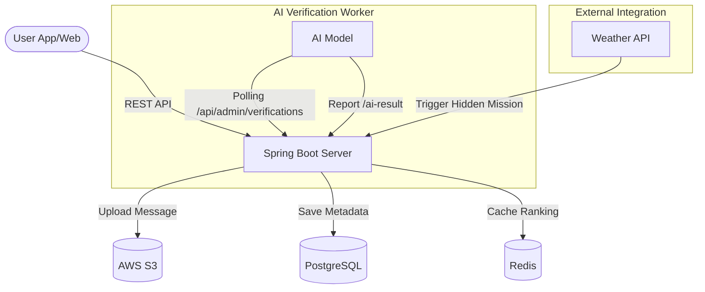
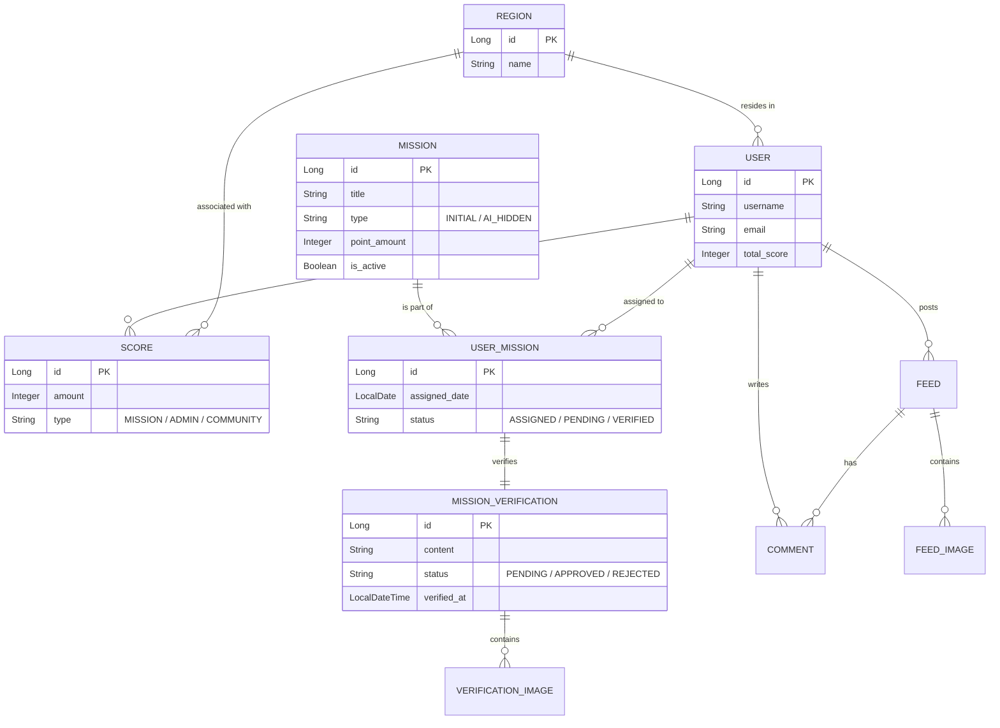

# 🏘️ 온동네 (On-Dongnae) - Backend


> **"당신의 동네를 더 즐겁게, 미션으로 연결되는 우리 동네 커뮤니티"**

온동네(On-Dongnae)는 지역 주민들이 일상 속에서 소소한 미션을 수행하고 보상을 받으며, 동네에 대한 애착을 높일 수 있도록 돕는 **지역 기반 커뮤니티 미션 플랫폼**입니다.

---

## 🚀 주요 기술적 하이라이트 (Technical Highlights)

본 프로젝트는 단순한 CRUD를 넘어, 다음과 같은 기술적 도전과 해결책을 포함하고 있습니다.

### 1. AI Worker 기반 자동 미션 인증 시스템
사용자가 업로드한 미션 인증 사진의 적절성을 AI가 실시간으로 판단합니다.
- **Async Polling Architecture**: 외부 AI Worker가 대기 중인 인증 건을 폴링하여 처리하는 비동기 구조.
- **High Reliability**: AI 분석 결과(Confidence Score)를 기반으로 자동 승인/반려 처리를 수행하며, 관리자 대시보드를 통해 최종 검수 과정을 보장합니다.

### 2. 실시간 환경 대응형 동적 미션 생성 (AI Hidden Missions)
고정된 미션 외에도, 외부 환경에 반응하여 생동감 넘치는 사용자 경험을 제공합니다.
- **Weather-Based Logic**: 특정 지역(서울 등)의 실시간 날씨 데이터와 연동하여 '비 오는 날 카페 가기'와 같은 히든 미션을 자동 생성합니다.
- **Dynamic Assignment**: 생성된 히든 미션은 해당 지역 사용자들에게 즉시 배정되어 참여도를 높입니다.

### 3. 고성능 랭킹 및 포인트 시스템
동네별 경쟁과 성취감을 고취시키기 위해 대규모 트래픽에서도 견고한 시스템을 구축했습니다.
- **Redis Caching**: 빈번하게 조회되는 지역별/전체 랭킹 데이터를 Redis Sorted Set으로 관리하여 초고속 조회를 실현했습니다.
- **Acid Transactions**: 포인트 지급 및 이력 관리의 무결성을 보장하기 위해 Spring Data JPA의 트랜잭션 관리를 철저히 적용했습니다.

### 4. 확장성이 뛰어난 도메인 기반 모듈 아키텍처
모놀리스 구조 내에서도 도메인 간의 결합도를 최소화하여 유지보수성을 극대화했습니다.
- **Domain Driven Design**: `mission`, `verification`, `score`, `user` 등 독립적인 모듈 구조로 설계.
- **Global Error Handling**: `@RestControllerAdvice`를 통한 공통 예외 처리 체계 구축.

---

## 🛠 Tech Stack

### Core
- **Framework**: Spring Boot 3.3.4
- **Language**: Java 17
- **Build Tool**: Gradle

### Persistence & Storage
- **Database**: PostgreSQL (RDBMS), Redis (Caching)
- **Object Storage**: AWS S3 (Media Files)

### Security
- **Authentication**: Spring Security, JJWT (JWT Token)

### API Documentation
- **Swagger**: SpringDoc OpenAPI 3.0

---

## 🏗 System Architecture

서비스의 전체 흐름과 컴포넌트 간의 상호작용은 다음과 같습니다.



---

## 📊 Database Schema (ERD)

데이터 간의 관계를 도식화한 ERD입니다.



---

## 📖 API Documentation

모든 API 명세는 Swagger를 통해 실시간으로 확인할 수 있습니다.

- **URL**: [https://api.on-dongnae.site/swagger-ui/index.html](https://api.on-dongnae.site/swagger-ui/index.html)
- **주요 Endpoint**:
    - `/api/missions`: 미션 조회 및 배정
    - `/api/verifications`: 인증 사진 제출 및 조회
    - `/api/scores`: 유저/지역별 랭킹 조회
    - `/api/feeds`: 지역 커뮤니티 게시글 관리

---

## ⚙️ Getting Started

### Prerequisites
- Java 17
- Docker (for PostgreSQL and Redis)

### Running with Docker (Recommended)
```bash
docker-compose up -d
```

### Local Development
1. `.env` 파일을 생성하고 필요한 환경 변수(DB, Redis, AWS Credentials)를 설정합니다.
2. 애플리케이션 실행:
```bash
./gradlew bootRun
```

---

## 👨‍💻 Contributors
- **Semo Group 1**
    - Backend: [solot](https://github.com/solot)

---
© 2026 On-Dongnae Project. All rights reserved.
